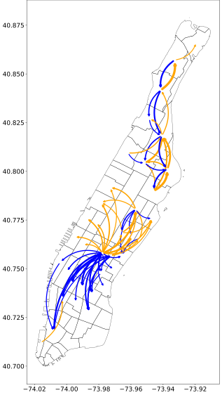
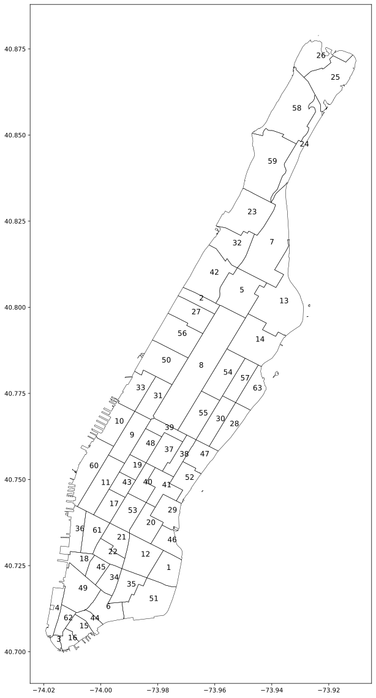

# ridesharing-optimization
Ride-sharing optimization formulation based on queuing theory [1].
<div align="center">
    
</div>

### :memo: Problem formulation

- Manhattan is divided into 63 zones.
- Traffic flow of each zone is modeled as an M/M/1 queue.
- Demand and supply of an M/M/1 queue are calculated from average traffic inflows and outflows during four years [2].
- The average traffic inflows and outflows are in `./data` for each time period (weekday morning, weekday lunch, weekday dinner, weekday night, weekend morning, weekend lunch, weekend dinner, weekend night).

Please refer to Section 5.4 of [1] for detailed notations and derivations. There are the two most important terms.
- $\frac{1}{\lambda_i}$: the average number of arriving passengers to zone $i$.
- $\frac{\rho_i}{\mu_i - \lambda_i}$: the average waiting time of serviced passengers at zone $i$.

#### Single vehicle control
$$\begin{align}
\max_{x, y} \quad & \sum_{i=0}^N \left(\alpha\frac{1}{\lambda_i} - \beta\frac{\rho_i}{\mu_i - \lambda_i}\right)y_i &\\
\textrm{s.t.} \quad 
& \sum_{i=0}^N \sum_{j=0}^N c_{ij}x_{ij} + \sum_{i=0}^N y_i \delta \leq \tau &\\
& \sum_{i,j \in S} x_{ij} \leq |S| - 1 &\forall S \subseteq \lbrace 0, 1, ..., N \rbrace, |S| \geq 2\\
& \sum_{j=0}^N x_{kj} = 1, \sum_{i=0}^N x_{ik} = 0, \sum_{j=0}^N x_{0j} = 0, \sum_{i=0}^N x_{i0} = 1 &\\
& \sum_{j=0}^N x_{ij} = y_i &\forall i \in \lbrace 1, ..., N \rbrace \setminus k\\
& \sum_{i=0}^N x_{ij} = y_j &\forall j \in \lbrace 1, ..., N \rbrace \setminus k\\
& x_{ij} \in \lbrace 0, 1 \rbrace &\forall i,j \in \lbrace 0, 1, ..., N \rbrace \\
& y_{i} \in \lbrace 0, 1 \rbrace &\forall i \in \lbrace 1, ..., N \rbrace \setminus k \\
& y_0 = y_k = 1
\end{align}$$
#### Multiple vehicle control
$$\begin{align}
        \max_{x,y} \quad & \sum_{i=0}^N \sum_{k=1}^V \left(\alpha \frac{1}{\lambda_i} - \beta \frac{\rho_i}{\mu_i - \lambda_i}\right)y_{ik} &\\
        \textrm{s.t.} \quad & \sum_{i=0}^N \sum_{j=0}^N c_{ijk} x_{ijk} + \sum_{i=0}^N \delta y_{ik} \leq \tau &\forall k \in \lbrace 1, ..., V \rbrace \\
        & \sum_{i, j \in S} x_{ijk} \leq |S| - 1 &\forall S \subseteq \{1, ..., N\}, |S| \geq 2, k \in \lbrace 1, ..., V \rbrace \\
        & \sum_{j=0}^N x_{ijk} = p_{ik} &\forall i \in \lbrace 0, ..., N \rbrace, k \in \lbrace 1, ..., V \rbrace \\
        & \sum_{i=0}^N x_{ijk} = p_{jk} &\forall j \in \lbrace 0, ..., N \rbrace, k \in \lbrace 1, ..., V \rbrace \\ 
        & \sum_{k=1}^V y_{ik} \leq 1 &\forall i \in \lbrace 1, ..., N \rbrace \\
        & \sum_{k=1}^V p_{0k} = V &\\
        & x_{ijk} \in \lbrace 0,1 \rbrace &\forall i, j \in \lbrace 1, ..., N \rbrace, k \in \lbrace 1, ..., V \rbrace \\
        & y_{ik} \in \lbrace 0,1 \rbrace &\forall i \in \lbrace 0, ..., N \rbrace, k \in \lbrace 1, ..., V \rbrace 
    \end{align}$$

Setting $\alpha=1$ and $\beta=0$ tries to serve as many passengers as possible.
### :runner: Run demo code
To use more decision variables and constraints, Gurobipy educational license [3] was used.
The location you want to start from and the time limit are needed. The location indices are as follows.
<div align="center">
    
</div>

#### Single vehicle control
```python
python3 single_fixed_depot.py -z ${depot_index} -l ${time_limit} -a ${alpha} -b ${beta}
```
For exmaple,
```python
python3 single_fixed_depot.py -z 3 -l 3600 -a 1 -b 0
```
#### Multiple vehicle control

### :earth_asia: Visualization

#### Single vehicle control

#### Multiple vehicle control

### :pushpin: References
[1] Lee, Jungeun and Kim, Sunhwi and Kim, Eunchong and Vo, Cong Phat and Song, Jeonghwan and Jeon, Jeong hwan, Deep Reinforcement Learning-Based Autonomous Ride-Sharing System. Available at SSRN: https://ssrn.com/abstract=4773032 or http://dx.doi.org/10.2139/ssrn.4773032  
[2] Donovan, Brian; Work, Dan (2016): New York City Taxi Trip Data (2010-2013). University of Illinois at Urbana-Champaign. https://doi.org/10.13012/J8PN93H8  
[3] Gurobi Optimization, L. (2023), Gurobi optimizer reference manual. https://www.gurobi.com